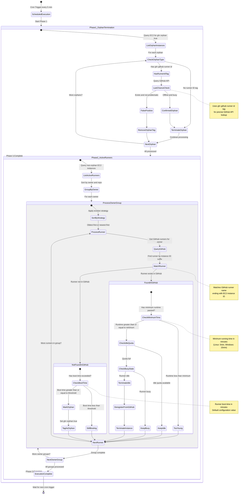

# GitHub Actions Runner Scale-Down State Diagram

<!-- --8<-- [start:mkdocs_scale_down_state_diagram] -->

The scale-down Lambda function runs on a scheduled basis (every 5 minutes by default) to manage GitHub Actions runner instances. It performs a two-phase cleanup process: first terminating confirmed orphaned instances, then evaluating active runners to maintain the desired idle capacity while removing unnecessary instances.

<!-- --8<-- [end:mkdocs_scale_down_state_diagram] -->

## Key Decision Points

| State | Condition | Action |
|-------|-----------|--------|
| **Orphan w/ Runner ID** | GitHub: offline + busy | Terminate (confirmed orphan) |
| **Orphan w/ Runner ID** | GitHub: exists + healthy | Remove orphan tag (false positive) |
| **Orphan w/o Runner ID** | Always | Terminate (no way to verify) |
| **Active Runner Found** | Runtime < minimum | Keep (too young) |
| **Active Runner Found** | Idle quota available | Keep as idle |
| **Active Runner Found** | Quota full + idle | Terminate + deregister |
| **Active Runner Found** | Quota full + busy | Keep running |
| **Active Runner Missing** | Boot time exceeded | Mark as orphan |
| **Active Runner Missing** | Still booting | Wait |

## Configuration Parameters

- **Cron Schedule**: `cron(*/5 * * * ? *)` (every 5 minutes)
- **Minimum Runtime**: Linux 5min, Windows 15min
- **Boot Timeout**: Configurable via `runner_boot_time_in_minutes`
- **Idle Config**: Per-environment configuration for desired idle runners
